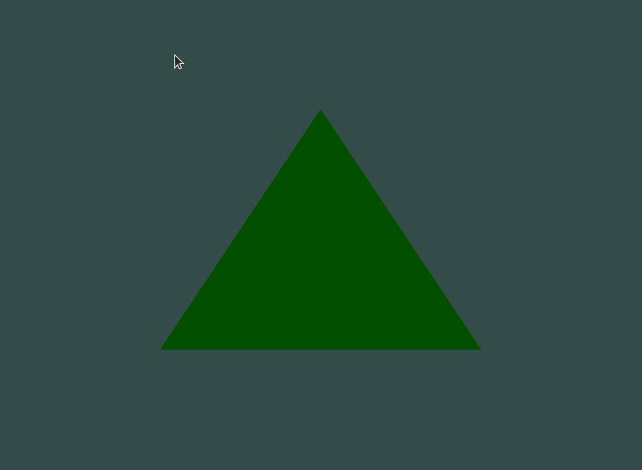

### Table of contents

- [Lab 01](#lab-01)
- [BASE](#base)
    - [Two Triangle](#two-triangle)
    - [Exercise 01](#exercise-01)
    - [Exercise 02](#exercise-02)
    - [Exercise 03](#exercise-03)
- [SHADERS](#shaders)
    - [First Example](#first-example-shaders)
    - [Second Example](#second-example-shaders)
    - [Change Color](#change-color)
- [Lab 02](#lab-02)

## Lab 01
[(Back to top)](#table-of-contents)
- Lab01:  Star

  

## BASE
[(Back to top)](#table-of-contents)
#### Two Triangle

  

#### Exercise 01
Try to draw 2 triangles next to each other using glDrawArrays by adding more vertices to your data.

  

#### Exercise 02
Now create the same 2 triangles using two different VAOs and VBOs for their data.

#### Exercise 03
Create two shader programs where the second program uses a different fragment shader that outputs the color yellow; draw both triangles again where one outputs the color yellow.

  

## SHADERS
[(Back to top)](#table-of-contents)

#### First Example Shaders

#### Second Example Shaders

  

#### Change Color
